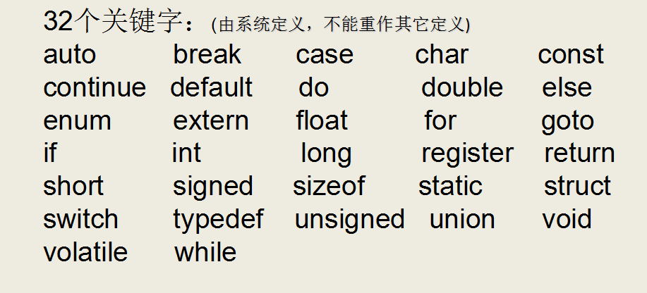
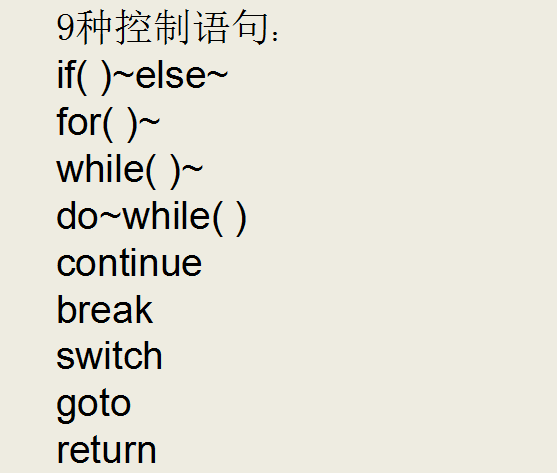
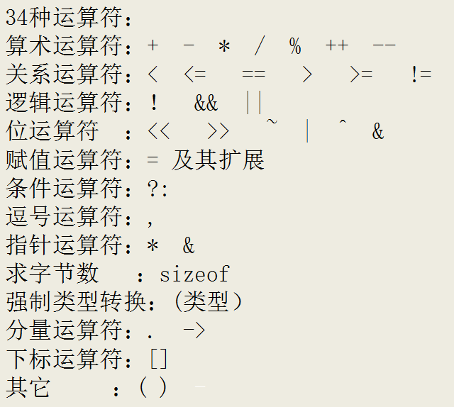

## 一、什么是c语言

### （一）简介

一提到语言这个词语，自然会想到的是像英语、汉语等这样的自然语言，因为它是人和人交换信息不可缺少的工具。

而今天计算机遍布了我们生活的每一个角落，除了人和人的相互交流之外，我们必须和计算机角落。

用什么的什么样的方式和计算机做最直接的交流呢？人们自然想到的是最古老也最方便的方式——语言，而C语言就是人和计算机交流的一种语言。

语言是用来交流沟通的。有一方说，有另一方听，必须有两方参与，这是语言最重要的功能：

- 说的一方传递信息，听的一方接收信息；
- 说的一方下达指令，听的一方遵循命令做事情。

语言是人和人交流，C语言是人和机器交流。只是，人可以不听另外一个人，但是，计算机是无条件服从。

语言有独特的语法规则和定义，双方必须遵循这些规则和定义才能实现真正的交流。

### （二）C语言特点

#### 1、 优点

- 代码量小
- 执行速度快

- 功能强大

- 编程自由

#### 2、缺点

- 写代码实现周期长
- 可移植性较差

- 过于自由，经验不足易出错

- 对平台库依赖较多

## 二、关键字

C语言仅有32个关键字，9种控制语句，34种运算符，却能完成无数的功能：







## 三、HelloWorld

C语言的源代码文件是一个普通的文本文件，但扩展名必须是.c。

- 通过gcc编译

>  gcc 编译    hello.c  -o生成的目标（可执行文件） 名字为  world

- c语言的编译步骤

>**预处理** 
>
>​    带#的语句就是预处理指令，预处理指令在预处理的时候处理了
>
>   头文件展开：  #include  <stdio.h> 包含文件stdio.h（预处理时将stdio.h 文件拷贝至预处理文件中）
>
>​    删除注释：  注释有两种方法：  //       /*  */
>
>​    宏替换： #define 代表是声明一个宏， 在预处理时会将宏给替代
>
>​    预处理时 不会检查语法错误
>
>​    条件编译： 条件不成立：  #if 0 -> #endif      条件成立 #if 1 -> #endif 
>
>**编译**
>
>​    将预处理文件编译生成汇编文件    
>
>​    检查语法错误
>
>**汇编**
>
>​    将汇编文件编译生成二进制文件.o
>
>**链接**
>
>​    设置运行环境，堆栈等，链接其他库

- helloworld程序的解释

```c
//# 预处理指令，在预编译时处理
//#include <stdio.h> 包含stdio.h文件  stdio.h类似于菜单
// 两个斜杠是注释
//符号与（）结和代表这个是一个函数
//main() main函数也叫主函数 整个程序中仅且只有一个main函数，程序从main函数
//开始执行
//int  代表main函数结束之后的返回值类型
//return  结束这个函数，然后返回值，返回值的类型和函数定义时返回值类型一致
//{}里面的是函数体，所有需要执行的代码必须写在{}中
//每一条代码必须以分号；结尾
//printf是一个库函数，printf+（）就是函数调用
#include <stdio.h>
int main()
{
        printf("hello world\n");//打印到终端
        return 0;
}
```

## 四、system  库函数

作用： 在程序中启动另一个程序

参数：要的是待启动程序的路径名

```c
#include <stdio.h>
#include <stdlib.h>
int main()
{
        //syetem启动程序，如果这个程序系统可以找到，不用加路径，
        //如果环境变量找不到，需要加路径
        //windows路径以\\  或 /
        //system("mspaint");//启动画图板
        //system("C:\\Users\\Administrator\\Desktop\\c++13\\hello.exe");
        system("C:/Users/Administrator/Desktop/c++13/hello.exe");
        printf("hello worldfbahfoahfoooooooooooooooooooooo\n");//打印到终端
        return 0;
}
```

## 五、报警处理

vs出现4996警告编号，只需要在文件的最前面加上一句话：

- 两者选其一

```c
#define _CRT_SECURE_NO_WARNINGS     //这个宏定义最好要放到.c文件的第一行
#pragma warning(disable:4996)    //或者使用这个
```

